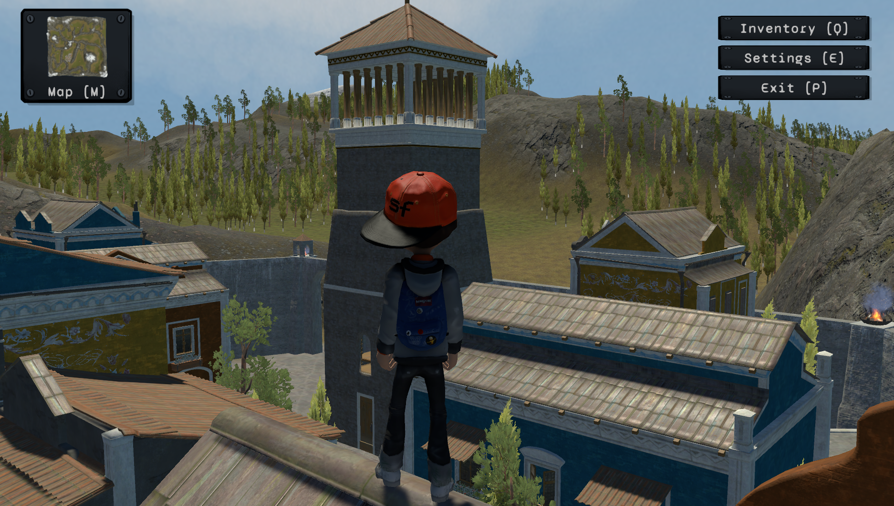

# FlyingHero

FlyingHero is a game in which you play a character who, unfortunately, cannot fly. Your goal is to find 24 hidden objects and to do this you will have to explore and discover places.
<br></br>


<br></br>
## Install the game

To be able to play FlyingHero you will need to follow the following steps:

- Clone the repository in the folder of your choice:

```git clone https://github.com/patricksardinha/FlyingHero.git```

- Install git-lfs to be able to access certain files (<ins>this step may not be necessary</ins>).

Go to https://git-lfs.github.com/ and download the extension and install it (inside the git repository folder) with the command:

```git lfs install```

Then track the ```.resS``` files:

```git lfs track "*.resS"```

And add the .gitattributes file:

```git add .gitattributes```

- Move to the build folder relative to your operating system (BuildsWin for Windows and BuildsMac for MacOS).

- Then start the application ```FlyingHero```.
<br></br>
## Play the game

Below are listed the commands to use in game:

**[W]** : Move Forward.

**[A]** : Move Left.

**[S]** : Move Backward.

**[D]** : Move Right.

Hold **[SHIFT]** : Run (by clicking simultaneously on **[W]** / **[A]** / **[S]** / **[D]**).

**[Espace]** : Jump.

**[LeftClick]** : Interact with an object.

**[Q]** : Open/Quit the inventory.

**[M]** : Open/Quit the map.

**[E]** : Open/Quit the settings.
<br></br>
## Quit the game

**[P]** : Quit the game.
<br></br>
## Credits

This game was made by **Unity 2021.3.11f** and use the following assets:

- Blink
- Mega Fantasy Props Pack
- Sparrow_Sounds
- SITIAN
- Sun_Temple
- TerrainSampleAssets
<br></br>
## Author

Patrick Sardinha
